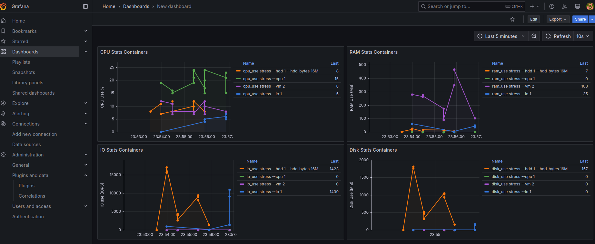

# Proyecto de Sistemas Operativos 1

## Script Contenedores

Este script en Bash permite crear y ejecutar contenedores Docker para realizar pruebas de estrés en CPU, memoria, disco y operaciones de E/S utilizando la herramienta stress dentro de la imagen containerstack/alpine-stress. Antes de ejecutarlo, se requiere tener Docker instalado y permisos adecuados para su uso. El script define variables de color ANSI para mejorar la legibilidad de los mensajes. Su funcionamiento inicia con un mensaje de inicio y luego ejecuta la función container_random, encargada de crear múltiples contenedores con diferentes configuraciones de carga.

```bash
docker run -d  --cpus="0.20" containerstack/alpine-stress stress --cpu 1
          
docker run -d --cpus="0.1" containerstack/alpine-stress stress --vm 2
            
docker run -d --memory="64M" containerstack/alpine-stress stress --io 1 
            
docker run -d --cpus="0.1" containerstack/alpine-stress stress --hdd 1 --hdd-bytes 16M 
```

<br>

## Modulo del Kernel

Este módulo del kernel de Linux está diseñado para monitorear en tiempo real el uso de CPU y memoria RAM tanto a nivel general del sistema como dentro de contenedores Docker. Se implementa como un archivo en /proc llamado sysinfo_202100119, desde donde se puede leer un JSON con estadísticas detalladas.

Para el monitoreo del uso de CPU general, se utiliza un trabajo diferido (delayed_work) que lee el archivo /proc/stat cada segundo. Se extraen valores de tiempo de CPU en diferentes estados y se calcula el porcentaje de uso con respecto a la lectura anterior. Esta información se actualiza periódicamente y se almacena en la variable cpu_general_use.

En cuanto al uso de memoria, se obtiene a partir de las estadísticas del kernel sobre la memoria usada y libre en el sistema. Se usan funciones como global_node_page_state y global_zone_page_state para calcular la memoria total, libre y en uso en megabytes.

Para la identificación de contenedores, se inspeccionan los cgroups de cada proceso en ejecución. Se extrae el identificador del contenedor a partir de la estructura cgroup, verificando si pertenece a Docker. Luego, se accede a los archivos del sistema de control de grupos (/sys/fs/cgroup/system.slice/docker-<id>.scope/) para leer estadísticas específicas de cada contenedor.

El uso de CPU de los contenedores se obtiene a partir del archivo cpu.stat, donde se toma la métrica usage_usec en dos momentos distintos con una diferencia de 250 ms, permitiendo calcular la variación y obtener un porcentaje de uso de CPU.

La memoria usada por cada contenedor se extrae del archivo memory.current, mientras que el uso de I/O y disco se obtiene del archivo io.stat, donde se leen los valores de wios (operaciones de escritura) y rbytes/wbytes (bytes leídos y escritos).

Finalmente, la información de todos los contenedores detectados se almacena en un arreglo de estructuras containers_struct_info y se imprime en formato JSON en el archivo /proc/sysinfo_202100119. Se garantiza que los contenedores no se dupliquen y se gestiona la memoria dinámicamente con kmalloc y kfree.

El módulo se carga con module_init(_insert) y se remueve con module_exit(_remove). Durante su inserción, se crea la entrada en /proc y se inicia la cola de trabajo para el monitoreo de CPU. Al ser removido, se limpian los recursos utilizados, asegurando que no queden procesos en ejecución.

para Cargar el modulo se debe de ejecutar la compilacion del mismo y luego la insercion de este en el sistema


```bash
cd Backend/Modules
make clean && make
sudo insmod build/sysinfo_202100119.ko

# remover el modulo
sudo rmmod sysinfo_202100119
```

<br>

## Servicio de Rust

Este código en Rust implementa un sistema de monitoreo y gestión de contenedores Docker basado en la información proporcionada por el archivo /proc/sysinfo_202100119. A continuación se explican las funcionalidades clave del código:

Primero, el programa lee y analiza la información del sistema desde el archivo /proc/sysinfo_202100119, que contiene estadísticas sobre el uso de la CPU, la memoria y la actividad de los contenedores en ejecución. Para esto, se utiliza la biblioteca serde_json para serializar y deserializar los datos en estructuras de datos definidas en el código con struct. De esta manera, se obtiene la información estructurada de los contenedores y el sistema.

Una de las principales funcionalidades es la detección y detención automática de contenedores que ejecutan la herramienta stress, utilizada para realizar pruebas de carga. El programa identifica los contenedores que ejecutan un comando que incluye stress, y si más de un contenedor está ejecutando el mismo tipo de prueba de carga (ya sea --cpu, --hdd, --io o --vm), el programa detiene el contenedor duplicado. Esto se logra ejecutando el comando docker stop <container_id>. Los detalles del contenedor detenido se guardan en un archivo JSON, lo que permite llevar un registro de los contenedores que fueron detenidos.

Además, el programa ejecuta un script Bash de forma periódica cada 40 segundos. Esto se logra a través de un hilo independiente que ejecuta el script proporcionado, permitiendo automatizar tareas adicionales de monitoreo o respuesta a eventos del sistema. Esta ejecución del script permite mantener el sistema actualizado con las acciones necesarias.

Otra característica importante es que al iniciarse el programa, se ejecuta automáticamente el comando docker-compose up -d. Esto asegura que los servicios necesarios, como Grafana y la API, estén activos y funcionando correctamente en el entorno de monitoreo. De esta manera, se facilita la gestión y monitoreo de los contenedores sin intervención manual.

El programa también implementa una gestión adecuada de los registros, utilizando un Mutex envuelto en un Arc. Esto garantiza que el acceso al archivo stopped_containers.json sea seguro en un entorno multihilo, evitando problemas de concurrencia cuando múltiples hilos intentan escribir en el archivo al mismo tiempo.

Finalmente, el código ejecuta múltiples hilos para realizar tareas de forma concurrente. El monitoreo de los contenedores ocurre cada 25 segundos en un hilo, mientras que la ejecución del script ocurre cada 40 segundos en otro hilo. Ambos hilos corren de forma indefinida, lo que permite un monitoreo continuo del sistema.


<br>

## API con Python

Este código utiliza FastAPI, un framework web para crear APIs de manera rápida y eficiente. El código define una aplicación con dos rutas: la primera es la ruta principal ("/") y la segunda es la ruta "/json_file".

La  ruta ("/json_file") tiene como propósito leer un archivo JSON llamado stopped_containers.json y devolver su contenido. Al hacer una solicitud GET a esta ruta, el servidor abre el archivo especificado en el sistema de archivos, lo lee con la biblioteca json de Python y luego retorna el contenido como respuesta. 

<br>

## Grafana

Este servicio utiliza un contenedor basado en la imagen oficial de Grafana (grafana/grafana:latest) para la visualización de métricas relacionadas con el uso de recursos de contenedores, como CPU, RAM, disco y IO. El contenedor se configura para exponer el puerto 3000, que es el puerto predeterminado para acceder a la interfaz web de Grafana. Al acceder a http://localhost:3000, los usuarios pueden monitorear y analizar en tiempo real los recursos utilizados por los contenedores detenidos. 


- **Usuario**: `admin`
- **Contraseña**: `sopes1`


