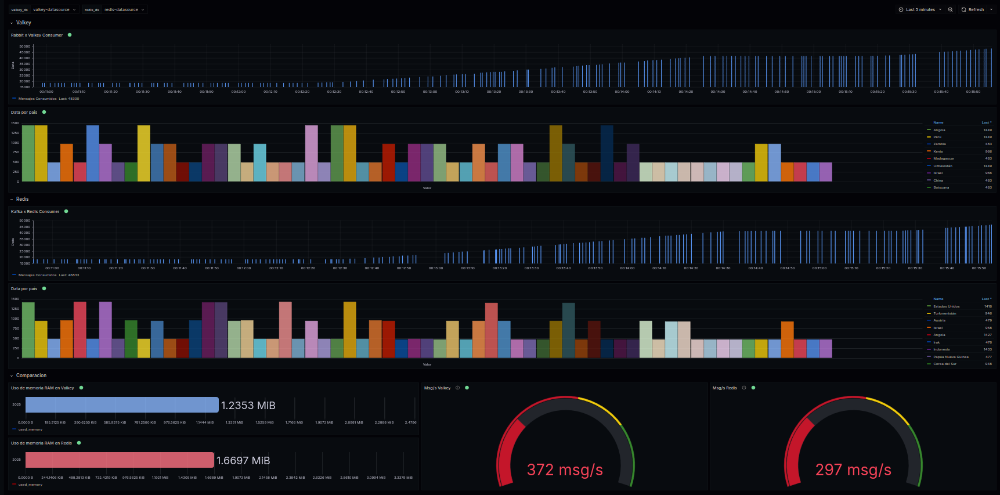

# Manual Tecnico Proyecto 2

El proyecto tiene como objetivo la utilizacion de kubernetes y el despliegue en la nube, el proyecto consiste en un sistema de "tweets" con el cual se busca generar una gran carga de trafico a travez de peticiones y endpoits, este sistema genera una gran carga en el sistema ya que necesita procesar multiples peticiones, y procesarlas y pasarlas a otros sistemas hasta llegar messages brokers para luego insertarlos en bases de datos no SQL y por ultimo visualizar los datos en tiempo real en Grafana

existen varios servicios que se utilizan en el proyecto que se especificaran mas a detalle:

## 🔁 Comunicación entre aplicaciones

### 🌐 API REST
- Estilo de arquitectura para comunicación HTTP.
- Usa JSON para intercambiar datos.
- Es **síncrona**: espera una respuesta inmediata.
- Ejemplo: `POST /weather`

### 🔗 gRPC (cliente y servidor)
- Sistema de comunicación moderno, rápido y eficiente.
- Usa **Protobuf** (binario) en lugar de JSON.
- Se define con archivos `.proto`.
- **Cliente gRPC**: llama funciones remotas.
- **Servidor gRPC**: expone funciones a otros servicios.
- Puede ser **síncrono o asíncrono**.

---

## 📩 Sistemas de mensajería

### 🐇 RabbitMQ
- **Message broker** basado en colas.
- Usa el protocolo AMQP.
- Comunicación **asíncrona**.
- Ideal para tareas en segundo plano (emails, procesamiento, etc.).

### ⚡ Apache Kafka (Strimzi Kafka en Kubernetes)
- Plataforma de **streaming distribuido**.
- Usa **topics** en lugar de colas.
- Guarda mensajes por tiempo definido.
- Excelente para **Big Data**, **logs**, y **event-driven systems**.

### 🧾 Consumers
- Programas que **leen mensajes** de RabbitMQ o Kafka.
- Procesan la información según el flujo de negocio.
- Se combinan para procesar de otra manera la informacion

---

## 🧠 Pruebas de carga y monitoreo

### 🐛 Locust
- Herramienta para **pruebas de carga**.
- Simula muchos usuarios que hacen peticiones.
- Útil para pruebas de rendimiento y stress testing.

### 📊 Grafana
- Plataforma para **visualización y monitoreo**.
- Muestra paneles con métricas en tiempo real.
- Se conecta a fuentes como Prometheus, Redis, etc.

---

## 🧱 Registro y almacenamiento

### 🛳️ Harbor
- **Registro privado de imágenes Docker**.
- Permite subir, escanear y controlar imágenes.
- Alternativa a Docker Hub, ideal para entornos empresariales y Kubernetes.

### 🧠 Redis y Valkey
- Bases de datos **clave-valor en memoria**.
- Altísimo rendimiento.
- Usos comunes:
  - Cache
  - Contadores rápidos
  - Almacenamiento de sesiones
- **Valkey** es un **fork libre de Redis** mantenido por la comunidad.

 

## 🐳 Docker y ☸️ Kubernetes

### ¿Qué es Docker?

**Docker** es una plataforma que permite crear, desplegar y ejecutar aplicaciones dentro de contenedores. Un contenedor es una unidad ligera y portátil que incluye todo lo necesario para que una aplicación se ejecute: código, runtime, librerías y configuraciones del sistema.

### 🔹 Características de Docker

- **Aislamiento:** Cada contenedor corre de forma independiente.
- **Portabilidad:** Funciona igual en desarrollo, pruebas y producción.
- **Eficiencia:** Es más liviano que una máquina virtual.
- **Rapidez:** Inicia en segundos.
- **Reproducibilidad:** Fácil de replicar entornos exactos.

### 🔧 Componentes principales de Docker

- **Docker Engine:** Servicio que permite construir y correr contenedores.
- **Dockerfile:** Archivo con instrucciones para construir una imagen.
- **Imagen Docker:** Plantilla para crear contenedores.
- **Contenedor:** Instancia de una imagen en ejecución.
- **Docker Hub:** Repositorio público de imágenes Docker.

---

## ¿Qué es Kubernetes?

**Kubernetes** (abreviado K8s) es una plataforma de orquestación de contenedores. Automatiza el despliegue, escalado y administración de aplicaciones en contenedores.

### 🔹 Características de Kubernetes

- **Escalado automático:** Añade o elimina contenedores según la carga.
- **Recuperación automática:** Reemplaza contenedores que fallan.
- **Balanceo de carga:** Distribuye el tráfico entre contenedores.
- **Despliegue continuo:** Facilita actualizaciones sin afectar la disponibilidad.
- **Gestión declarativa:** Define el estado deseado de tu sistema.

### 🔧 Componentes principales de Kubernetes

- **Cluster:** Conjunto de nodos (máquinas) que ejecutan contenedores.
- **Nodo:** Máquina (física o virtual) que corre aplicaciones.
- **Pod:** Unidad mínima de Kubernetes, puede contener uno o más contenedores.
- **Deployment:** Controla cómo se despliegan los pods.
- **Service:** Expone los pods como un servicio accesible en red.
- **Ingress:** Gestiona el acceso externo a los servicios (por HTTP/HTTPS).

---

## 🚀 ¿Cómo se complementan Docker y Kubernetes?

- Docker se encarga de **empaquetar** aplicaciones.
- Kubernetes se encarga de **administrar** esas aplicaciones empaquetadas a gran escala.

Usarlos juntos permite desplegar apps de manera más rápida, eficiente y con alta disponibilidad.

 

## Funcionamiento del sistema

1. El sistema descarga las imagenes de Docker del registry Harbor
2. Locust hace las peticiones al ingres, que distribuye la carga al servicio de rust, que contiene una API
3. Pasa a una segunda API en Go, y a su vez a un gRPC Client
4. El gRPC Client manda las peticiones a 2 gRPC Server, uno para Kafka y otro para RabbitMQ
5. Los gRPC Server se encargan de metar cada uno de los mensajes recividos a las colas.
6. Los consumers extraen y procesan la informacióm para luego meterla en Redis y Valkey
7. Grafana extrae estos datos de las bases de datos y las muestra en graficos en tiempo real

 

# 📘 Preguntas

## 🌀 ¿Cómo funciona Kafka?

**Apache Kafka** es una plataforma distribuida para el procesamiento de flujos de datos en tiempo real. Está diseñada para ser altamente escalable, tolerante a fallos y extremadamente rápida.

### 🔧 Arquitectura básica de Kafka

- **Productores (Producers):** Aplicaciones que envían datos a Kafka.
- **Temas (Topics):** Categorías o canales donde se almacenan los mensajes.
- **Particiones:** Cada tema se divide en particiones para distribuir la carga.
- **Consumidores (Consumers):** Aplicaciones que leen datos desde Kafka.
- **Broker:** Servidor Kafka que almacena los datos y gestiona las solicitudes.
- **Zookeeper:** Sistema auxiliar que gestiona la configuración y el consenso del clúster (aunque ya se está migrando a KRaft para eliminar Zookeeper).

### 🧭 ¿Cómo fluye la información?

1. Un **productor** publica un mensaje en un **tema**.
2. El mensaje se almacena en una **partición** del tema.
3. Uno o varios **consumidores** se suscriben al tema y leen los mensajes en orden.

Kafka es ideal para sistemas **event-driven**, **microservicios**, y procesamiento de datos en **streaming**.

 

## 🔁 ¿Cómo difiere Valkey de Redis?

**Valkey** es un fork comunitario de Redis, creado después de que Redis Labs cambió la licencia del proyecto original (Redis pasó de BSD a una licencia no completamente libre).

### 🧩 Diferencias clave entre Valkey y Redis:

| Característica     | Redis                          | Valkey                        |
|--------------------|--------------------------------|-------------------------------|
| Licencia           | Redis Source Available (RSAL)  | BSD 3-Clause (100% open)     |
| Comunidad          | Controlado por Redis Ltd.      | Proyecto abierto, gobernado por la comunidad |
| Compatibilidad     | Altamente compatible           | Totalmente compatible         |
| Futuro             | Enfocado en productos comerciales | Enfocado en la libertad y comunidad |
| Código base        | Original de Redis              | Fork de Redis 7.2.4 (marzo 2024) |

Valkey busca mantenerse libre, abierta y comunitaria, similar a cómo ocurrió con **MariaDB** después del cambio en **MySQL**.

 

## 🌐 ¿Es mejor gRPC que HTTP?

**Depende del caso de uso**, pero aquí te doy una comparación clara entre **gRPC** y **HTTP REST tradicional**.

### 🔍 Comparación general:

| Característica       | gRPC                            | HTTP/REST                    |
|----------------------|----------------------------------|------------------------------|
| Protocolo            | HTTP/2 + Protobuf               | HTTP/1.1 + JSON              |
| Rendimiento          | Más rápido (binario)            | Más lento (texto)            |
| Tolerancia a errores | Estricta                        | Más flexible                 |
| Streaming            | Soportado (bidireccional)       | Limitado (solo long polling) |
| Definición de API    | `.proto` (esquemas estrictos)   | OpenAPI/Swagger (opcional)  |
| Lenguajes            | Multi-lenguaje (autogenerado)   | Multi-lenguaje (manual)      |
| Legibilidad          | Baja (binario)                  | Alta (JSON legible)          |
| Adopción             | Alta en microservicios internos | Alta en APIs públicas        |

### ✅ ¿Cuándo usar gRPC?

- Comunicación entre microservicios.
- Alta eficiencia y bajo consumo de red.
- Necesidad de streaming de datos en tiempo real.

### ✅ ¿Cuándo usar HTTP REST?

- APIs públicas o integraciones con terceros.
- Mayor interoperabilidad con clientes que usan navegador.
- Cuando se prefiere legibilidad y simplicidad.

 

## 🚀 ¿Hubo mejora al utilizar dos réplicas en los Deployments de API REST y gRPC?

### 🧪 Respuesta corta

**No hubo una mejora tan crítica como se esperaba.** Aunque se observaron pequeños beneficios en concurrencia y manejo de carga, la mayor ganancia vino del uso de **gRPC**, que es considerablemente más rápido que HTTP REST en términos de rendimiento y eficiencia.

### ⚙️ Justificación técnica

#### 🔁 Réplicas en los Deployments

Usar dos réplicas en los Deployments (tanto para la API como para los servidores gRPC) ayuda a distribuir la carga y mejorar la tolerancia a fallos, pero:

- En este caso **la carga principal está en los servidores gRPC**, donde se hace procesamiento en paralelo con `goroutines`.
- La API en Fiber es muy liviana y rápida, por lo que **no se convierte en un cuello de botella**, incluso con una sola réplica.
- Las réplicas fueron útiles en pruebas de carga, pero **no escalaron tanto el rendimiento como se esperaba**, ya que los recursos del clúster y el procesamiento interno (por ejemplo, I/O o redes) seguían siendo los límites reales.

### ⚡ Ventajas de gRPC frente a HTTP REST en tu caso

El mayor impacto positivo vino del uso de **gRPC**, por varias razones:

#### 1. 🔄 Comunicación binaria eficiente

- gRPC usa **Protocol Buffers (Protobuf)**, que es mucho más ligero que JSON.
- La serialización/deserialización es más rápida y ocupa menos espacio.

#### 2. 🚀 Transmisión por HTTP/2

- Soporta **multiplexación**, es decir, múltiples mensajes en una sola conexión TCP.
- Reduce la latencia y mejora el rendimiento en llamadas paralelas.

#### 3. 🧵 Paralelismo en el cliente

Tu API está enviando chunks de datos en paralelo (10 goroutines por servidor), lo que:

- **Satura bien el ancho de banda disponible.**
- Permite que los dos servidores gRPC (Kafka y RabbitMQ) reciban datos al mismo tiempo.
- gRPC lo maneja mucho mejor que una REST API que procesaría cada chunk secuencialmente.

### 📊 Conclusión

Si bien añadir réplicas aporta algo de mejora en resiliencia y concurrencia, en este caso **no fue un cambio tan crítico** porque:

- El procesamiento ya era eficiente.
- El protocolo gRPC fue el verdadero impulsor de rendimiento.
- Tu estrategia de **paralelismo con goroutines y chunking** ya optimizaba bastante bien el flujo de datos.

Por tanto, **la mayor mejora proviene del protocolo (gRPC) y el diseño del cliente**, más que de la replicación en sí.

 

## ¿Qué utilicé para los consumidores y por qué?

### RabbitMQ + Valkey

- **RabbitMQ** fue utilizado como sistema de colas de mensajes porque proporciona:
  - Fiabilidad en la entrega de mensajes (*message acknowledgment*).
  - Entrega ordenada.
  - Buen manejo de cargas moderadas de datos.
  - Ideal para arquitecturas *push-based*.

- **Valkey** (fork de Redis) fue elegido como sistema de almacenamiento temporal en memoria por:
  - Su velocidad para operaciones como `HINCRBY` e `INCR`.
  - Su compatibilidad con Redis y facilidad de integración en Go.
  - Uso eficiente de estructuras de datos como `hash` para contar ocurrencias por país.

- **Goroutines** fueron utilizadas para procesar múltiples mensajes en paralelo, configuradas dinámicamente con una variable de entorno (`NO_GOROUTINES`), lo cual permite escalar según los recursos disponibles.

---

### Kafka + Redis

- **Kafka** fue seleccionado como sistema de colas de alta disponibilidad y rendimiento porque:
  - Soporta altos volúmenes de mensajes (*pull-based*).
  - Es ideal para sistemas distribuidos y procesamiento en tiempo real.
  - Permite mantener el historial de mensajes, útil para depuración o reenvío.

- **Redis** fue utilizado como backend para el almacenamiento de contadores por:
  - Su rapidez en operaciones en memoria.
  - La madurez y estabilidad de su cliente oficial en Go.
  - Eficiencia para estructuras clave-valor y operaciones atómicas.

- Al igual que en el caso anterior, se usaron **goroutines** y **canales** (`chan []byte`) para distribuir el trabajo entre varios workers, lo que mejora el rendimiento y el uso de CPU.
